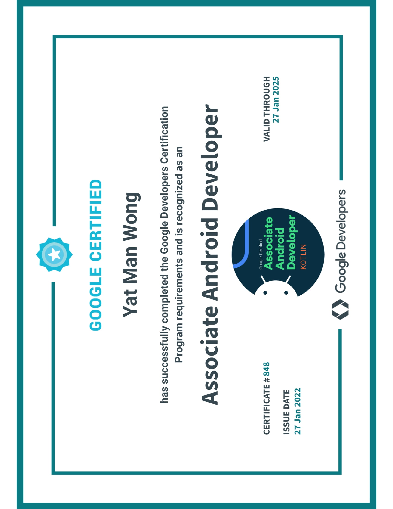

# Android Exam Study Guide

Topic taken from https://developers.google.com/certification/associate-android-developer/study-guide

* When taking the exam, make the database part working first and populate the initial data. Once you can see the table in Android Studio inspect database, everything make more sense

* Next get the MainActivity running

* The general / toolbar is done for you

* DAO/ repository layer is mostly done for you

* Test is mostly just fill in the data fetching logic for UI layer

* No test cases asked

[certificate pdf](cert/certificate.pdf)

